<p align="center">
  
</p>

<h1 align="center">Udhav Wadhawan</h1>

<p align="center">
  <strong>I turn “what if?” into systems that can handle “what now?”</strong>
</p>

<p align="center">
  Product-minded full-stack engineer · builder across the whole request path
</p>

<p align="center">
  <a href="https://udhv.space">Home</a>
  ·
  <a href="mailto:udhavwadhawan@hotmail.com">Email</a>
  ·
  <a href="https://x.com/angerastra">X</a>
</p>

---

### I followed a request

I did not set out to collect frameworks. I followed a request.

It started at the surface: a person clicks, types, waits. That small moment opened
into a longer trail—through state and APIs, permissions and queues, databases and
deploys. Every layer answered one question and revealed the next.

```text
curiosity → interface → logic → data → systems → reliability → curiosity
```

That loop is still how I build.

<table>
  <tr>
    <td width="50%" valign="top">
      <h3>01 / Make it feel obvious</h3>
      A product begins as a conversation with its user. I care about the quiet
      details: useful defaults, clear states, and interfaces that explain
      themselves.
    </td>
    <td width="50%" valign="top">
      <h3>02 / Follow it past the screen</h3>
      A polished surface is only the entrance. I follow the request into the API,
      through its rules, and down to the data until the whole path makes sense.
    </td>
  </tr>
  <tr>
    <td width="50%" valign="top">
      <h3>03 / Let the pieces talk</h3>
      As products grow, one path becomes many. Services, events, jobs, caches, and
      clients need a shared language—not just more code.
    </td>
    <td width="50%" valign="top">
      <h3>04 / Make “boring” the superpower</h3>
      The best systems make failure unsurprising. I look for the slow query, the
      unsafe boundary, and the missing fallback before they become the story.
    </td>
  </tr>
</table>

### The way I work

```text
Listen for friction
    └── trace the entire path
          └── design the smallest coherent system
                └── ship, observe, simplify
                      └── leave a clearer path for the next builder
```

I am most at home where product thinking and engineering depth overlap: close
enough to the interface to understand the human problem, and deep enough in the
system to solve the real one.

### A few artifacts from the trail

- **[Wendor Fullstack](https://github.com/w-udhav/wendor-fullstack)** — a shop,
  an operations surface, and the machinery connecting them.
- **[CRM Education](https://crm-education.vercel.app)** — everyday workflows
  turned into a focused operating tool.
- **[Design 360](https://design-360-ebon.vercel.app)** — a visual identity paired
  with a content system built to evolve.
- **[udhv.space](https://udhv.space)** — the corner of the internet where the
  experiments become personal.

<details>
  <summary><strong>The tools change. The shape of the work does not.</strong></summary>
  <br />
  React / Next.js / TypeScript · Node.js / Express / NestJS · PostgreSQL / MongoDB
  · Prisma / Sequelize · Redis / queues / real-time events · Sanity / Strapi ·
  React Native / Expo
</details>

### The work, over time

<p align="center">
  
</p>

<p align="center">
  <sub>This landscape is regenerated daily. If it is empty, the first build is still finding its way.</sub>
</p>

---

<p align="center">
  <strong>Bring me the problem that crosses boundaries.</strong><br />
  <a href="mailto:udhavwadhawan@hotmail.com">udhavwadhawan@hotmail.com</a>
  ·
  <a href="https://udhv.space">udhv.space</a>
  ·
  <a href="https://www.youtube.com/channel/UC3VXG1VFD4mZo3GecovK2UA">after-hours edits</a>
</p>
