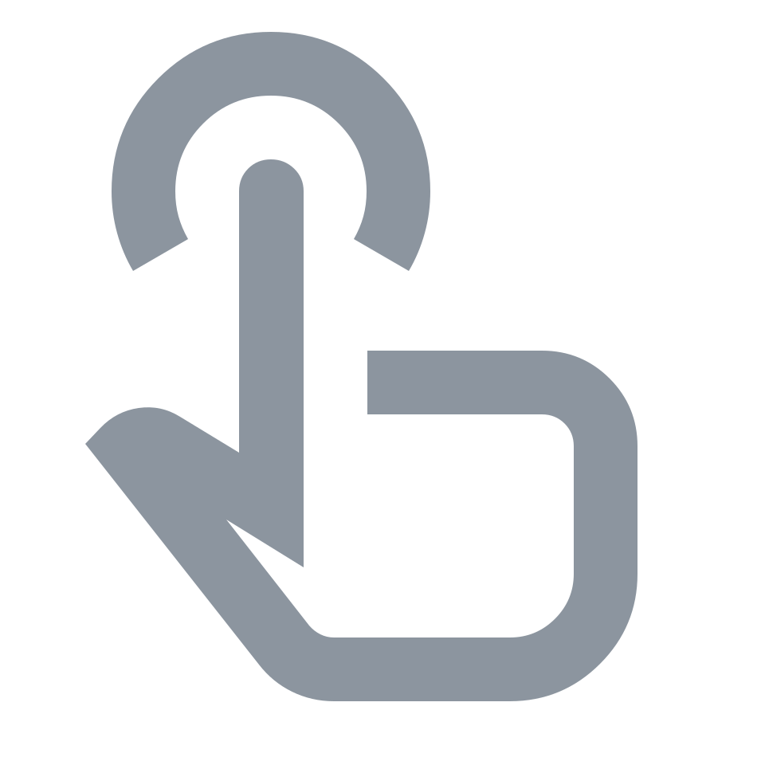
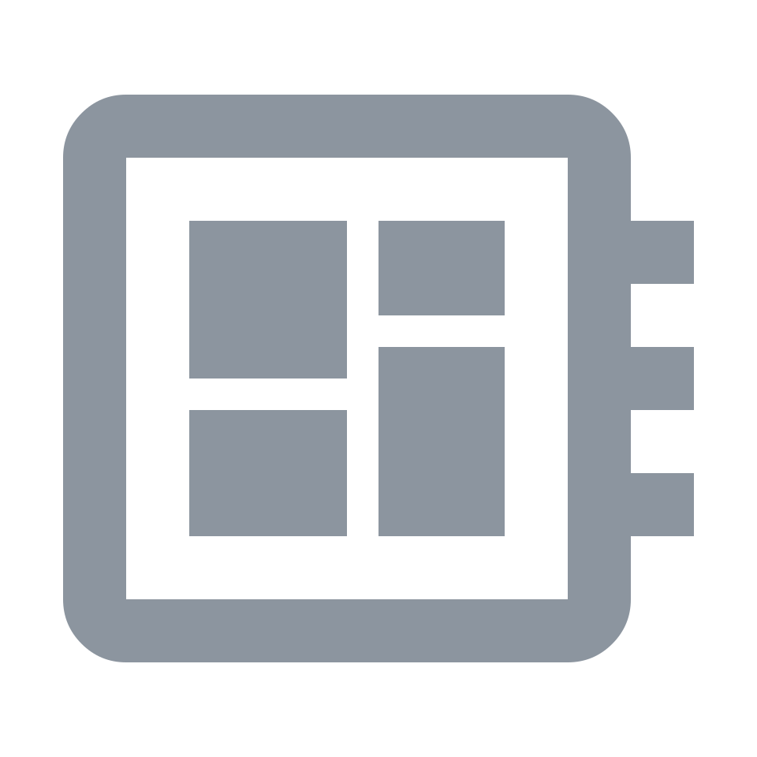
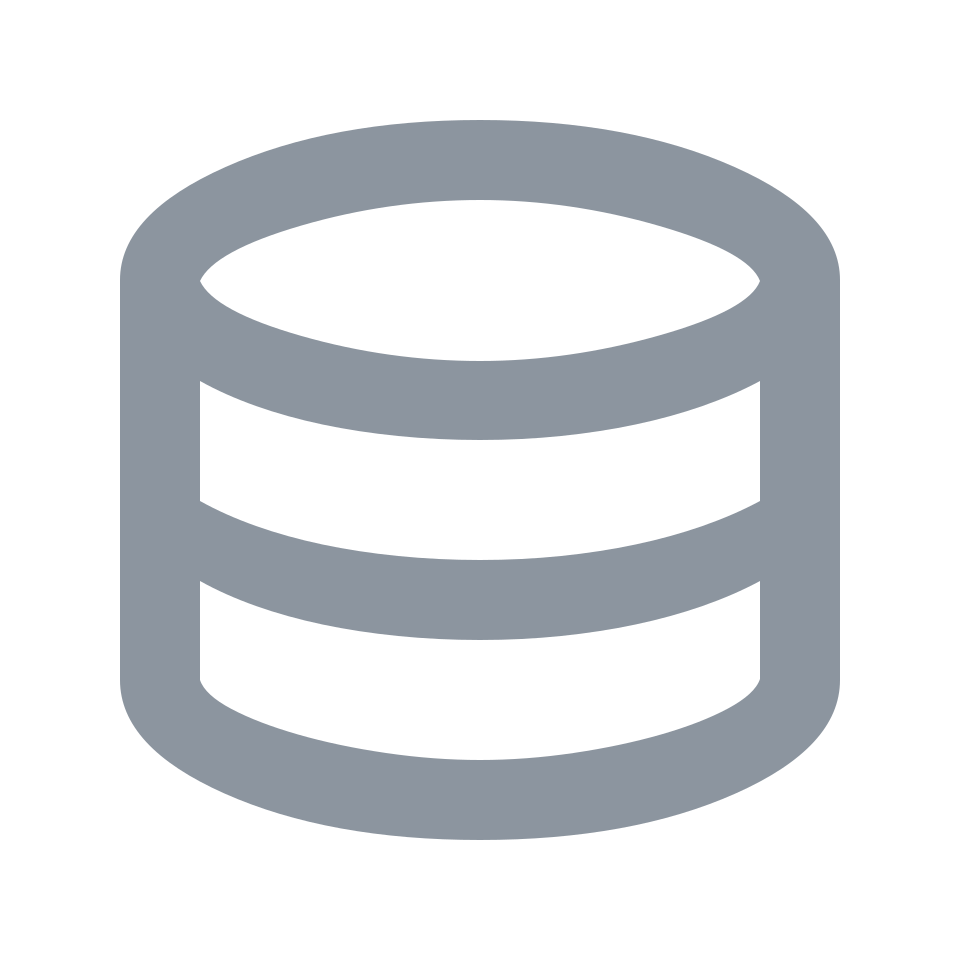
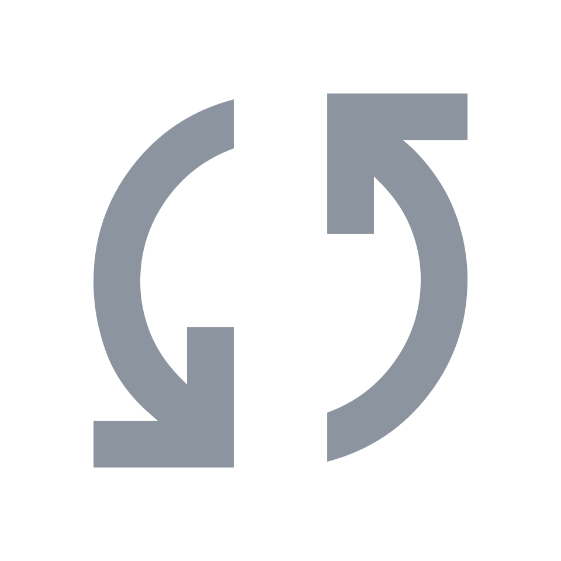
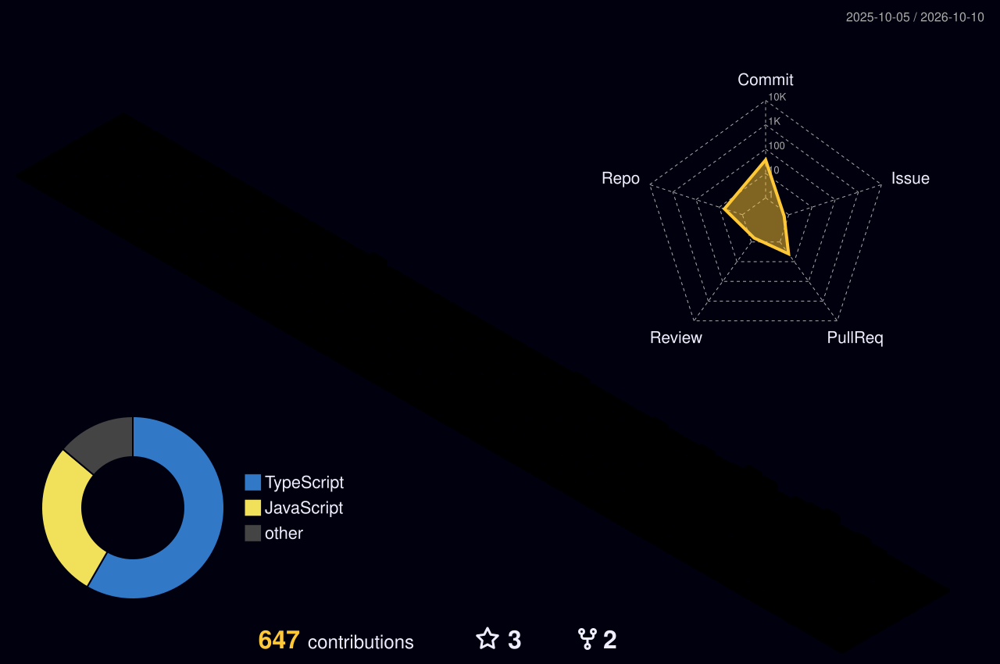

  <strong>Udhav Wadhawan</strong> 
  <a href="https://udhv.space">Home</a> ·
  <a href="mailto:udhavwadhawan@hotmail.com">Email</a> ·
  <a href="https://x.com/angerastra">X</a>

 

<h1 align="center">It starts with a click.</h1>

  A small expectation: 
  something should happen.

 

<h3 align="center">Behind that moment, an entire system wakes up.</h3>

  
  &nbsp;&nbsp;→&nbsp;&nbsp;
  
  &nbsp;&nbsp;→&nbsp;&nbsp;
  
  &nbsp;&nbsp;→&nbsp;&nbsp;
  

 

  The interface asks a question. 
  The API decides what is allowed. 
  The database remembers. 
  The queue keeps everything moving.

  Every piece matters. 
  But the product lives in the way they connect.

 

<h2 align="center">I build those connections.</h2>

  I'm Udhav—a full-stack engineer who follows an idea 
  all the way into a dependable product.

  Not just the screen. 
  Not just the server. 
  <strong>The whole path.</strong>

 

<h2 align="center">Good software should feel simple.</h2>

  The complexity can stay behind the product. 
  What reaches the person should feel clear, fast, and trustworthy.

  So I start with the friction. 
  Trace it to the real constraint. 
  Build the smallest coherent system. 
  Then simplify it again.

 

## Some ideas became places you can visit.

- **[Wendor Fullstack](https://github.com/w-udhav/wendor-fullstack)** — A storefront, an operations surface, and the machinery that keeps them in agreement.
- **[CRM Education](https://crm-education.vercel.app)** — A scattered daily process, brought into one shared flow.
- **[Design 360](https://design-360-ebon.vercel.app)** — An architecture studio's work, given a digital space and room to keep evolving.
- **[udhv.space](https://udhv.space)** — Where the experiments become personal.

  
<strong>Tools are choices, not the identity.</strong>

   
  React / Next.js / TypeScript · Node.js / Express / NestJS · PostgreSQL / MongoDB
  · Prisma / Sequelize · Redis / queues / real-time events · Sanity / Strapi ·
  React Native / Expo

 

<h2 align="center">Built one decision at a time.</h2>

  No launch montage. Just the work, compounding.

  

  Regenerated daily from the work along the way.

 

<h2 align="center">Have a problem that refuses to stay in one layer?</h2>

  <strong>Let's build through it.</strong>  
  <a href="mailto:udhavwadhawan@hotmail.com">udhavwadhawan@hotmail.com</a> ·
  <a href="https://udhv.space">udhv.space</a> ·
  <a href="https://www.youtube.com/channel/UC3VXG1VFD4mZo3GecovK2UA">after-hours edits</a>

